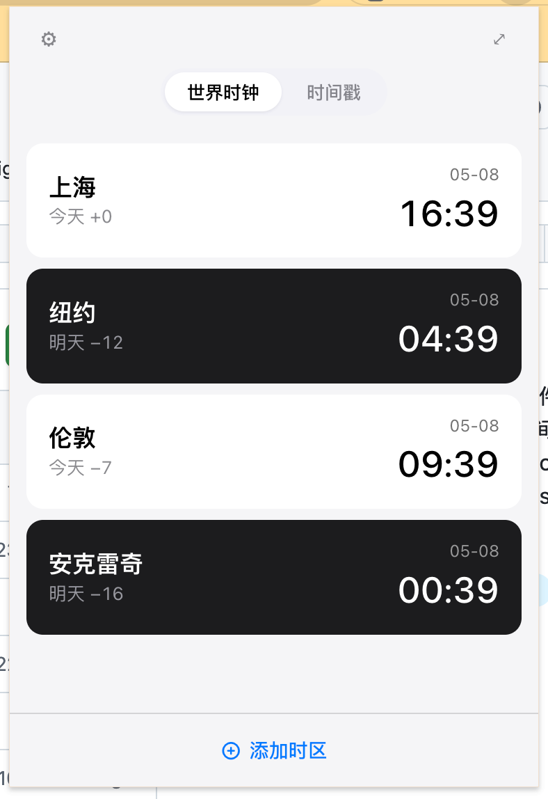
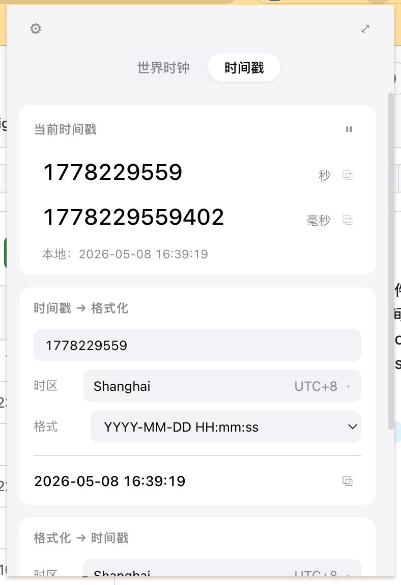
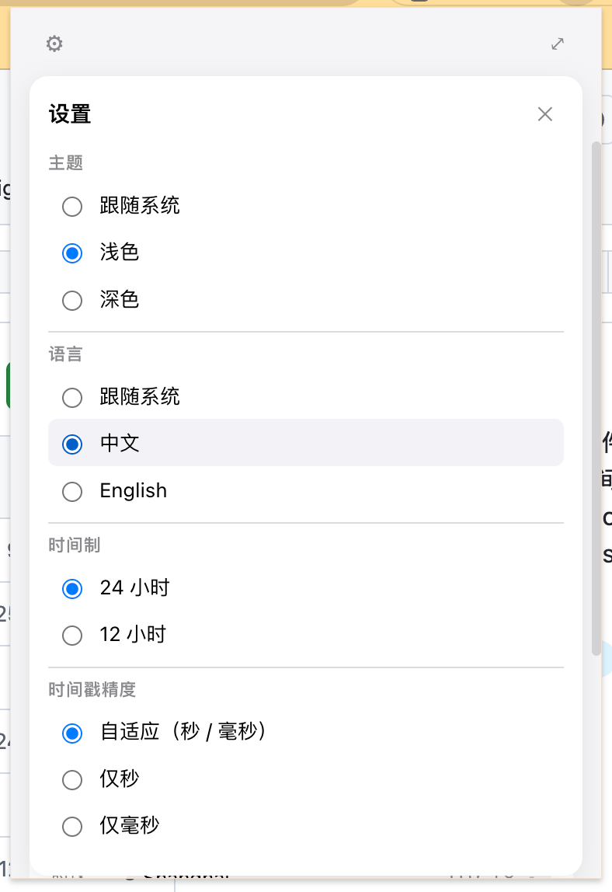

# Time Master

[](https://github.com/nilsir/time-master/actions/workflows/build.yml)

> 面向开发者的时间工具 Chrome 插件，把时间戳转换、世界时钟等高频操作收敛到浏览器工具栏，点开即用。

## 截图

<p align="center">
  
  
  
</p>

## 功能特性

- **世界时钟** — macOS 风格卡片，自动识别昼/夜配色，自选时区，左滑删除
- **当前时间戳** — 实时展示秒级与毫秒级时间戳，点击即复制，支持暂停
- **时间戳 → 格式化** — 输入任意 10 位（秒）或 13 位（毫秒）时间戳，转换为任意 IANA 时区的可读时间
- **格式化 → 时间戳** — 输入格式化时间字符串，反查对应时间戳
- 中英双语 · 浅色 / 深色 / 跟随系统主题 · 12 / 24 小时制 · Popup + 独立悬浮窗

## 安装使用

1. 前往 [Releases](https://github.com/nilsir/time-master/releases) 页面，下载最新版 `time-master.zip`
2. 解压，得到 `dist/` 目录
3. 打开 Chrome，访问 `chrome://extensions`，开启右上角「开发者模式」
4. 点击「加载已解压的扩展程序」，选择解压后的 `dist/` 目录
5. 工具栏出现 Time Master 图标，点击即可使用

## 开发

```bash
npm install       # 安装依赖
npm run dev       # 启动开发服务器（支持 HMR）
npm run build     # 生产构建，输出 dist/
npm run test      # 运行单元测试
npm run typecheck # TypeScript 类型检查
```

构建产物在 `dist/`，在 `chrome://extensions` 开发者模式下加载即可调试。

## 技术栈

| 类别 | 技术 |
|---|---|
| 框架 | Vue 3 + TypeScript + `<script setup>` |
| 构建 | Vite + @crxjs/vite-plugin |
| 时间处理 | Day.js（utc + timezone + customParseFormat 插件）|
| 存储 | chrome.storage.sync |
| 样式 | 原生 CSS Variables |
| 测试 | Vitest |
| 发布 | semantic-release（语义化版本自动发布）|

---

# Time Master

[](https://github.com/nilsir/time-master/actions/workflows/build.yml)

> A Chrome extension for developers — timestamp conversion, world clock, and more. All in one click from your browser toolbar.

## Screenshots

<p align="center">
  
  
  
</p>

## Features

- **World Clock** — macOS-style cards with automatic day/night colors, custom timezones, swipe-left to delete
- **Current Timestamp** — Live seconds & milliseconds timestamps with one-click copy and pause support
- **Timestamp → Formatted** — Convert any 10-digit (seconds) or 13-digit (ms) timestamp to a human-readable time in any IANA timezone
- **Formatted → Timestamp** — Parse a formatted time string back to a Unix timestamp
- Bilingual (zh/en) · Light / Dark / System theme · 12 / 24-hour · Popup + standalone floating window

## Installation

1. Go to [Releases](https://github.com/nilsir/time-master/releases) and download the latest `time-master.zip`
2. Unzip to get the `dist/` folder
3. Open Chrome → `chrome://extensions` → enable **Developer mode** (top-right toggle)
4. Click **Load unpacked** → select the `dist/` folder
5. The Time Master icon will appear in your toolbar — click to launch

## Development

```bash
npm install       # install dependencies
npm run dev       # start dev server with HMR
npm run build     # production build → dist/
npm run test      # run unit tests
npm run typecheck # TypeScript check
```

## Tech Stack

| Category | Technology |
|---|---|
| Framework | Vue 3 + TypeScript + `<script setup>` |
| Build | Vite + @crxjs/vite-plugin |
| Time | Day.js (utc + timezone + customParseFormat) |
| Storage | chrome.storage.sync |
| Styles | Native CSS Variables |
| Testing | Vitest |
| Release | semantic-release (automated semver) |
